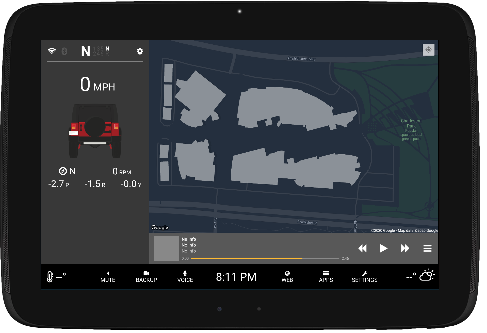

# AutoDash
Android based car dashboard app

## Tablet Prerequisites

1. Install Android Kernel based on RR and Timur's (Android 7.1.2)
1. Install GApps
1. Install required apps (Google Maps, Spotify, Weather Underground, etc...)
1. Enable Spotify broadcast notifications in Spotify app settings
  - Set Device Broadcast Status to ON in the Spotify app’s settings
1. Install AutoDash
1. Enable AutoDash as Device Admin in Android Preferences
